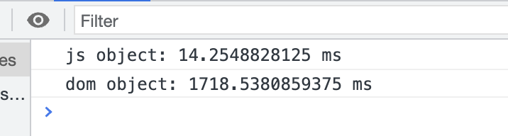

# vue相关面试题

1. 请阐述一下```v-model```的原理

2. 请你阐述一下对vue虚拟dom的理解
    - 什么是虚拟dom？
        虚拟dom本质上就是一个普通的JS对象, 用于描述视图的界面结构
        在vue中, 每个组件都有一个render函数, 每个render函数都会返回一个虚拟dom树, 这也就意味着每个组件都对应一颗虚拟dom树
    - 为什么需要虚拟dom？
        在vue中, 渲染视图会调用render函数, 这种渲染不仅发生在组件创建时, 同时也发生在视图依赖的数据更新时, 如果在渲染时, 直接使用真实dom, 去对真实dom进行crud, 会带来大量的性能损耗, 从而会极大地降低渲染效果
        ```js
        const times = 10000000;
        console.time("js object")
        for (let i = 0; i < times; i++) {
            const obj = {
                tag: "div",
                props: {},
                child: null,
            }
        }
        console.timeEnd("js object");

        console.time("dom object");
        for(let i = 0; i < times; i++) {
            const div = document.createElement("div");
        }
        console.timeEnd("dom object");
        ```
        

        根据上面的例子我们不难看出, 光是创建真实dom消耗的性能就是创建普通js对象的n倍, 还不说我们频繁的更新真实dom造成页面的重排的问题
    - 虚拟dom是如何转换为真实dom的？
        在一个组件实例首次被渲染时, 他先生成虚拟dom树, 然后根据虚拟dom树生成真实dom, 并把真实dom挂载到页面中合适的位置, 此时, 每个虚拟dom都会对应一个真实dom。
        如果一个组件受响应式数据变化的影响, 需要重新渲染时, 他仍然会调用render函数, 创建出一个新的虚拟dom树, 直接抛弃旧树, 使用新树, 最后通过新树 会去修改他们对应的真实dom
    - 模板和虚拟dom的关系
        vue框架中有一个compile模块, 他主要负责将模板转换为render函数, 而调用render函数以后就会得到虚拟dom
        编译的过程分为2步:
        1. 将模板字符串转换为AST
        2. 将AST转换为render函数
        如果使用传统的引入方式或者vue-cli的配置中开启了runtimeCompiler: true, 则编译时间发生在组件的第一次加载时, 这称之为运行时编译。
        如果是在vue-cli的默认配置下, 编译发生在打包时, 这称之为模板预编译
        编译是一个极其耗费性能的操作, 预编译可以有效的提升运行时的性能, 而且, 由于运行的时候已经不需要编译, vue-cli会在打包时排除掉vue的compile模块, 以减少打包体积
        **vue最终运行的时候, 需要的是render函数, 而不是模板, 因此模板中的各种语法, 在虚拟dom中都是不存在的, 他们都会变成虚拟dom的配置**

3. 请阐述vue的diff算法

    当组件创建或者更新时, vue均会执行内部的update函数, 该函数使用render函数生成新的虚拟dom树, 组件会直接指向新树抛弃旧树, 但是vue会比对新旧两棵树, 找出差异, 最终将这些差异应用到真实dom

    对比差异的过程叫做diff, vue在内部会通过一个叫做patch的函数完成该过程

    在对比时, vue采用深度优先, 逐层比较的方式进行对比。

    在判断两个节点是否相同时, vue是通过虚拟节点的key和tag来进行判断的
    
    具体来说: 首先对根节点进行对比, 如果key和tag都相同则将旧节点关联的真实dom的引用直接重用, 挂载到新节点上, 然后根据比对得出需要更新的属性, 并更新到真实dom, 然后再对比其子节点数组, 如果不相同, 则按照新节点的信息递归创建所有真实dom, 同时挂载到对应的虚拟节点上, 然后移除旧的dom, 在对比其子节点的数组时, vue对每个子节点数组使用两个指针, 分别指向头尾, 然后不断向中间靠拢来进行对比, 这样做的目的是尽量复用真实dom, 尽量少的销毁和创建真实dom, 如果发现相同, 则进入和根节点一样的比对属性流程, 如果发现不同, 看看有没有可能移动真实dom到合适的虚拟节点位置

    也是基于上面这一点, 在实际的开发中我们在循环时需要给定key值, 否则比如翻转数组或者给数组的头部插入元素的时候, vue在diff的时候会发现每一个虚拟dom都不一样了, 他是会重用父级节点, 但是子节点会全部销毁重做, 因为他没有key, 假设之前的虚拟dom是[1, 2, 3, 4, 5], 向头部插入了一个0, 新的虚拟dom就是[0, 1, 2, 3, 4, 5], 由于你没有给key值, 他会发现1和0都是li标签可以重用, 但是子元素不一样了, 所以直接把旧子元素进行全部销毁创建新的子元素, 实际上来说新树的第二个li是可以和旧树的第一个li重用的, 但是你没有给key值 所以他不知道, 新树的最后一个5竟然还是要重新构建的, 和旧树的5一模一样, 旧树的5因为去和4对比了所以莫名其妙删了, 所以上面如果你不给key值, 你付出的代价就是5个li的子元素全部重新构建, 最后一个值为5的元素直接重新生成, 而如果你给了key值, vue就会根据key值去找到对应的节点, 他就会知道哦原来旧树的第一个和旧树的第二个是同一个, 是可以复用的, 所以最后1， 2， 3， 4， 5全部重用, 就多加了一个0的li, 从这里我们又可以得到一个比较细节的规则:
    1. 如果有key值, vue优先找寻key值是否相等
    2. 如果没有key值, vue会继续找寻tag是否相等, 上面的问题就处在旧树的5个都是li, 新树的6个也都是li, 你没有给key值, 所以他默认旧树的第一个和新树的第一个是同一个元素, 只是子元素不同了

    还有一个开发中会遇到的问题就是两个input的转换, 比如我点击一个按钮就会将用手机号输入框变成用邮箱登陆的输入框, 这时候如果我们不给两个input打上key, 则会出现进入邮箱登陆的输入框时, 在手机号输入框填写的东西还在, 这就是vue他直接重用了dom, 这种情况下我们是不需要他重用dom的, 所以我们必须补key值

    1. diff的时机
        当组件创建时, 以及依赖的属性或者数据变化时, 会运行一个函数, 该函数会做两件事
        - 运行```_render```生成一颗新的虚拟dom树
        - 调用```_update```传入新生成的虚拟dom树的根节点, 将新旧两棵树进行对比, 最终完成真实dom的更新
        ```js
        function Vue() {
            var updateComponent = () => {
                this._update(this._render());
            }
        }
        ```

        而diff就发生在_update函数的运行过程中

    2. update函数在干什么

        ```_update```函数接受一个vnode参数, 这就是新生成的虚拟dom树, 同时```_update```函数通过当前组件的```vnode```属性, 拿到旧的虚拟dom树, 首先```update```会直接将组件的vnode属性指向新树, 然后会判断旧树是否存在:
        - 不存在: 说明这是第一次加载组件, 于是通过内部的patch函数, 直接遍历新树, 为每个节点生成真实dom, 挂载到每个节点的elm上
        - 存在: 说明之前已经渲染过该组件, 于是通过内部的patch函数, 将新旧两棵树进行对比, 以达到下面两个目标
            - 完成对所有真实dom的最小化处理
            - 让新树的节点对应合适的真实dom
    
    3. patch函数的对比流程:
        - 术语解释:
            - 相同: 是指两个节点的标签类型, key值均相同, 但是如果是input元素还需要看type属性
            - 新建元素: 指通过一个虚拟节点提供的信息, 创建一个真实dom元素, 同时挂载到虚拟节点的elm属性上
            - 销毁元素: 指的是vnode.elm.remove方法
            - 更新: 是指两个虚拟节点进行对比更新, 他仅发生在两个虚拟节点相同的情况下, 
            - 对比子节点: 是指对两个虚拟节点的子节点进行对比
        
        - 根节点比较:
            patch函数首先对根节点进行比较:
            - 如果相同(进入更新流程):
                1. 将旧节点的真实dom赋值到新节点: newVNode.elm = oldVNode.elm
                2. 对比新旧虚拟节点的属性, 有变化的需要应用到真实dom中
                3. 当两个节点对比完毕, 开始对比子节点
            - 不相同:
                1. 新节点递归新建元素
                2. 旧节点销毁元素
        - 对比子节点的处理方式:
            - 尽量啥也别做
            - 不行的话, 仅改动元素属性
            - 还不行的话尽量移动元素, 而不是删除和创建元素
            - 还不行的话 删除和创建元素 
            - 具体流程如下:
                - 给新树和旧树各自打上一个头尾指针
                - 对比新树和旧树的头指针指向的虚拟dom是否相同, 如果相同进入更新流程（同样要进行子节点的比较）, 然后将新树和旧树的头指针向右移动一格 如果不相同, 则比较两棵树的尾指针是否一样
                - 如果尾指针指向的虚拟dom一样则进入尾指针的节点更新流程, 同时将新树和旧树的尾指针向左移动一格, 如果尾指针对应的两个虚拟dom都不一样, 则会比较旧树的头和新树的尾是否相同:
                    - 如果相同, 将新树的尾指针对应的虚拟dom复用旧树的头指针对应的虚拟dom, 这时候就需要移动位置, 将真实dom移动到**旧树**的尾指针后面, 然后再将新树的尾指针和旧树的头指针各自向前移动一格, 继续重复比较
                    - 如果不相同: 则比较新树的头指针和旧树的尾指针, 重复上面的流程

4. computed和methods有什么区别？
    标准而浅显的回答:
    1. 在使用时, computed当做属性使用, 而methods当做方法调用
    2. computed可以具有getter和setter, 因此可以赋值, 而methods不行
    3. computed无法接收多个参数, methods可以
    4. computed具有缓存, methods没有
    更接近底层原理的回答:
    > vue对于methods的处理比较简单, 只需要遍历methods配置中的每一个属性, 将其对应的函数使用bind绑定当前组件实例然后复制其引用到组件实例中即可, 而vue对于computed的处理会复杂一些:
    > 当组件实例触发生命周期函数beforeCreate以后, 他会做一系列事情, 其中就包括对computed的处理, 他会遍历computed配置中的所有属性, 为每一个属性创建一个Watcher对象, 并传入一个函数, 该函数的本质其实就是computed配置中的getter, 这样一来getter运行时就会收集依赖, 但是和函数不同, 为计算属性创建的watcher并不会立即执行, 因为要考虑到该计算属性是否会被渲染函数使用, 如果没有使用则不会立即执行, 因此在创建Watcher的时候, 他使用了lazy配置, lazy配置可以让Watcher不会立即执行, 受到lazy的影响, Watcher内部会保存两个关键属性来实现缓存, 一个是value, 一个是dirty, value属性用于保存Watcher运行的结果, 受lazy的影响, 最开始是undefined, dirty属性用于指示当前的value是否已经过时了, 即是否为脏值, 受lazy的影响, 最开始为true。
    > Watcher创建好以后, vue会使用代理模式, 将计算属性挂载到组件实例中, 当读取计算属性时, vue检查其对应的Watcher是否为脏值, 如果是, 则运行函数, 计算依赖, 并得到对应值, 保存在Watcher的value中, 然后设置dirty为false, 并返回值
    > 巧妙的是在收集依赖时, 被依赖的数据不仅会收集到计算属性的Watcher, 还会收集到组件的Watcher, 当计算属性的依赖发生变化时, 会先触发Watcher的执行, 他只需要设置dirty为true即可, 不做任何处理, 由于依赖同时会收集到组件的Watcher, 因此组件会重新渲染, 而重新渲染时又读取到了计算属性, 由于计算属性的dirty目前已经为true, 因此会重新运行getter的计算
    > 而对于计算属性的setter, 则极其简单, 当设置计算属性时, 直接运行setter即可

5. 谈谈你对vite的理解, 最好对比webpack说明
    > webpack由于会考虑到浏览器兼容性的问题, 所以他在开发环境下, 当你敲下yarn start命令的时候, 他会先在内存里进行打包（打包过程就是分析依赖, 执行loader）之类的, 然后当你访问开发服务器的时候将打包结果返回给你, 这样得到了兼容性的好处, 不过当你的项目越来越庞大的时候, 你就知道痛苦了, 开启开发服务器的时间会越来越长
    > vite则更好的利用了es module的优势, 当你敲下yarn dev命令的时候, vite会直接把index.html给你, index.html中引入了一个main.js, 也就是你工程的入口脚本文件, 当你在访问开发服务器的时候, 浏览器发现index.html依赖了main.js, 就去请求main.js, main.js在服务器经过编译以后将结果返回给浏览器, 然后main.js import了App.vue, 浏览器又回去请求App.vue, 于是服务器又将编译后的App.vue(使用vue自己的库进行编译compiler-sfc)给浏览器, 所以这就是vite速度快的秘诀, 他类似于按需加载, 所以无论你的项目多大, vite都能很快的启动项目, 但是也基于这一点, vite只能在现代浏览器里使用, 而且不能使用commonjs。
    > 而在hmr热更新阶段, 当改动了一个模块以后, vite只需要让浏览器在请求一次该模块即可, 而webpack需要将该模块的相关依赖全部重新编译一次, 效率会低很多
    > 生产环境的build中vite使用rollup进行打包, 效率和webpack不会差太多, 所以vite的优势主要在开发环境

6. vue3的效率主要提升在哪些方面
    - 静态提升
        - 没有绑定动态内容的静态节点会被直接提升(即不会进入render函数中重复构建)
        - 如果一个元素有绑定动态内容, 但是他有静态属性, 那虽然这个节点不会被提升, 但是静态属性会被提升
    - 预字符串化
        - 当编译器遇到大量连续的静态内容, 会直接将其编译为一个普通的字符串节点, 这些字符串直接一把梭了, n个节点直接变成一个静态节点
    - 缓存事件处理函数: 事件处理函数在没有变化的前提下, 就会直接缓存（不会进行二次编译）
    - block tree: vue3对静态节点会直接拉黑, 不会让静态节点进入diff的比较, 结合与字符串化和静态提升, 你能想想提升了多少性能
    - patch flag: vue3在编译的时候会给每个节点打上标记, 来记录他这个节点哪一块是动态的(是元素内容？ 还是class属性？ 还是style属性？), 然后再diff的时候, 比对新旧节点时只会比对这些动态属性

7. 为什么vue3中去掉了vue构造函数？
    > 主要是因为设计上有点不太合理:
    > 1. 调用构造函数的静态方法会对所有的vue应用生效, 比如Vue.use, 不利于隔离不同应用, 我举个例子, 我A应用想用vuex, B应用不想用, 这种情况没法做到
    > 2. vue2的构造函数集成了太多的功能, 不利于tree shaking, vue3将这些函数都通过具名导出来导出, 可以充分利用好tree shaking来优化体积
    > 3. vue2没有把组件实例和vue应用两个概念区分开, 在vue2中虽然他官方说通过new Vue创建出来的是vue应用, 通过createElement创建的是vue组件, 但是在直观感觉上, vue应用和vue实例的方法属性全部一致（比如什么$set, $delete都同时在vue应用和vue组件上）, 让人很困惑, 而vue3, 通过createApp创建的vue应用就已经完全和vue组件区分开了, vue应用提供的方法也只是针对全局的
    ```js
    // vue2
    Vue.use(new Vuex(...));

    // vue3
    const app = createApp();
    app.use(new Vuex(...));
    ```

8. 谈谈你对vue3数据响应式的理解
    > vue2和vue3都是在beforeCreate之后created之前完成数据响应式的, 不过实现数据响应式的方案不一样, vue2会递归遍历数据, 将数据的每一个属性都追加Object.defineProperty进行getter和setter的设定, 从而追加数据响应式, 这种做法有点暴力, 而且有缺陷, 就是当对象数据的属性进行了新增和删除操作的时候, Object.defineProperty没办法感知, 所以vue2单独提供了$set和$delete以及数组的变异方法来弥补这个缺陷, 而vue3直接使用Proxy来代理整个数据对象, Proxy不必遍历所有属性, 而是直接得到一个Proxy实例, 对数据的访问是动态的, Proxy是在访问某个属性的时候才会动态的获取或者设置, 这就极大的提高了组件初始化时的效率, 同时, 由于Proxy可以监听到成员的新增和删除, 因此在vue3中新增删除成员都是触发重新渲染的, 这在vue2中必须要使用$set, $delete才可以做到

9. vue3有哪些新变化?
    - 模板中的变化:
        - 支持多根节点
        - v-model的全面更新:
            - 在vue2中, 我们知道v-model是@input + value的语法糖, 如果我们需要对一个组件追加两个双向绑定的数据, 我们最多只能存在一个input, 另一个就必须使用.sync修饰符
                ```vue
                <!-- 简写 -->
                <CheckEditor v-model="value" />
                <!-- 非简写 -->
                <CheckEditor :value="value" @input="text=$event" />

                <!-- 简写 -->
                <CheckEditor :text.sync="text" />
                <!-- 非简写 -->
                <CheckEditor :text="text" @update="text=$event" />
                ```
                这里会让人觉得很怪异, 既然都是在做双向数据绑定, 为什么要用两种语法呢？所以vue3直接把v-model进行了重新设计:
                - 在vue3中直接取消了.sync修饰符, 并追加了一些新特性: v-model不再是value + @input的语法题, 而是变成了modelValue + @update的语法题
                    ```vue
                    <!-- vue3 -->
                    <CheckEditor v-model="value" v-model:text="text"  />

                    <!-- 非简写模式 -->
                    <CheckEditor 
                        @update:modelValue="value=$event" 
                        :value="value"
                        @update:text="text=$event"
                        :text="text"
                    />
                    ```
                - 此外值得一提的是, vue3还给v-model赋予了一些新的能力, 就是可以自定义修饰符:
                    ```vue
                    <!-- 追加了email修饰符, 这个修饰符是官方没有的, 是我们自定义的, 所以我们必须在CheckEditor内部去实现它-->
                    <CheckEditor v-model.email="value" v-model:text="text"  />
                    ```

                    ```vue
                    <!-- CheckEditor.vue -->
                    <template>
                        <input type="text" :value="modelValue" @input="handleInput" >
                    </template>

                    <script setup>
                        import { defineProps, watchEffect } from "vue";
                        const props = defineProps({
                            modelValue: String,
                            modelModifiers: Object, // 声明一下属性修饰符
                        })

                        watchEffect(() => {
                            console.log("modelValue", props.modelValue);
                        })

                        const emits = defineEmits(["update:modelValue"])

                        const handleInput = (e) => {
                            let _value = e.target.value;
                            console.log("value", _value, props.modelValue, props.modelModifiers);
                            if (props.modelModifiers.email) {
                                _value = _value + "@163.com";
                            }
                            console.log("value2", _value);
                            emits("update:modelValue", _value);
                        }
                    </script>

                    <style>

                    </style>
                    ```
        - v-for和v-if的变化
            > 在vue2中, 尽管vue2官方有明确告知: 虽然v-for优先级比v-if高, 但是仍然不建议将v-for和v-if绑定在同一个元素上, 但是还是有不少人会这样去做, 但是vue3就直接把v-if的优先级设定高于v-for了。
    - 数据响应式的变化:
        > vue2过去使用Object.defineProperty进行数据代理, 他的主要处理流程就是递归遍历数据的每一个属性, 并追加Object.defineProperty为每一个属性去定义getter和setter, 以便于追加Watcher, 这样做的缺陷一个是有可能需要遍历大量的数据, 造成性能损耗, 二一个是没法监听成员的删除和新增, 所以vue2又追加了$set和$delete以及数组的变异方法去弥补这个缺陷, 而vue3直接使用es6的Proxy来定义getter和setter, Proxy是动态的, 可以监听到成员的新增和删除, 同时Proxy也不会一开始就将所有的数据全部遍历设置上getter, 而是对根数据进行代理以后对根数据成员的访问进行控制和动态获取。
    - vue3取消了构造函数Vue, 从而转用createApp来创建vue应用, 这样做主要是为了弥补vue2的一些设计缺陷:
        - 如果你的工程里有多个vue应用, 没法做到插件指令隔离, 因为都在调用Vue.use
        - vue应用和vue组件对象傻傻分不清, vue应用上竟然也会出现$set等方法
        - vue2的构造函数集成了太多的方法不利于tree shaking
    - reactivity api 和 composition api的重大更新(见之前的文档)
    - vue3的效率提升: 见上面
    - 第三方库的协同变更: vue-router以及vuex
    - 新的生命周期注入

- vue的Watcher是干嘛的
    > 每个组件都对应一个Watcher实例, 他会在组件渲染(调用render函数)的过程中把用到的数据全部收集进依赖, 之后当依赖项的setter触发时, 会通知Watcher, 从而使得他关联的组件重新渲染

- 清阐述vue的响应式原理
    > 响应式原理主要围绕着Vue的四个小玩具来进行的
    > 1. Observer: 这个构造函数主要是用来进行代理和追加getter和setter的, 我们外部不能使用, 实际上也可以隐式的使用(我记得好像是调用Vue.observable), 具体实现上, 这个函数主要就是用了Object.defineProperty进行深度递归遍历为每个属性追加setter和getter 当追加了getter和setter以后, 我们在对数据访问就能够被Vue监听到, 从而可以做一些事情, 但是在这个过程中还是有一些意外的, 因为vue2是用Object.defineProperty递归遍历每个数据, 这样的缺陷一个就是没法感知到对象数据成员的新增和删除, 所以vue2提供了$set和$delete还有数组变异方法来弥补这个缺陷, 另一个就是性能损耗比较大, 但是Vue3使用了Proxy以后就很好的解决了这个问题
    > 2. Dep: 在Observer的过程中我们只知道Vue他追加了getter和setter, 但是getter和setter各自要做什么事, Observer是管不着的, 就是读取属性和设置属性时分别要干些啥, Vue会为每个响应书数据创建一个Dep实例, 每个Dep实例都可以做两件事: 1. 在读取属性时(调用getter)记录更新（调用dep.depend, 比如是组件的render函数用了他就记录render函数, 是watch用了就记录watch）, 记下是谁在用我 2. 在设置属性（调用setter）时派发更新(调用dep.notify), 告诉用了这个属性的人该属性变化了
    > 3. Watcher:  我们知道Dep的依赖收集过程是在读取属性时, 也就是调用getter时, 那这里有个问题, 他怎么知道调用他的是watch还是render? getter又不能传递额外的参数过去, 他怎么知道是谁在调用他呢？ 他记录依赖的时候记录谁呢？Watcher就是来解决这个问题的, 比如当执行一个render前, 他会在全局设置一个Watcher, 类似于currentWatcher = this的操作, 然后使用Watcher去执行render, 在render函数的执行过程中, 如果发生了依赖记录, Dep就会收集起来: 有一个Watcher依赖了我这个属性, 在Dep派发更新的时候, 他实际上通知的就是所有的Watcher, 每一个组件实例都至少对应一个watcher, 该watcher中记录了该组件的render函数。
    > 4. Scheduler: Dep每次通知Watcher有更新以后, Watcher如果都执行对应的函数, 是不是有点太频繁了, 比如我一个函数里改了3次同一个响应式数据的值, 是不是会触发三次setter, 那这三次是不是都要重新渲染？所以Watcher接受到更新通知以后, 并不会马上运行对应函数, 而是把自己交给一个叫做调度器的东西, 调度器会周期性的将watcher放入到微队列中(调用nextTick), 也就是说render函数是异步的, 会在微队列中等待执行