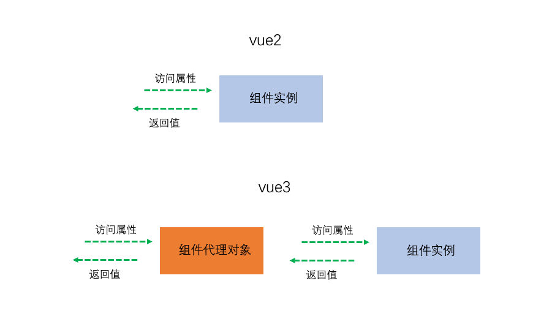

# vue3的重大变化

1. vue3不存在构造函数```Vue```, 取而代之的是```createApp```

    ```js
    // vue2 
    import Vue from "vue";

    new Vue(options).mount("#app");
    ```

    ```js
    // vue3
    import { createApp } from "vue";
    import App from "./App,vue";

    createApp(App).mount("#app");
    ```

2. 关于this指向, vue2中的this是指向整个组件实例, vue3中的this得到的是一个proxy
    

3. 在过去, options api让vue在开发大型项目的时候略显吃力, 所以vue3推出了composition api
    
    ```js
    // vue2
    export default {
      data: () => ({
        count: 0,
      })
      methods: {
        increase() {
          this.count ++;
        }
      }
    }
    ```

    ```js
    // vue 3
    import { ref } from "vue";
    export default {
      // setup函数会在所有生命周期钩子函数之前调用
      // setup函数中的this指向的是undefined
      // setup函数的返回值会被挂载到组件实例中去, 也就意味着可以被template使用
      setup() { 
        const countRef = ref(0); // ref给你提供一个响应式的数据(类似于在vue2中写在data中的数据), 其实就是类似于react的hooks
        const increase = () => {
          countRef.value = countRef.value + 1;
        }
        return {
          countRef,
          increase
        }
      }
    }
    ```

    有了composition api以后, vue也具备了抽离逻辑的能力

    ```js
    // useCount.js
    import { ref } from "vue";

    export default function useCount(initialCount = 0) {
      const countRef = ref(initialCount);
      const increase = () => countRef.value = countRef.value + 1;
      const decrease = () => countRef.value = countRef.value - 1;
      return {
        countRef,
        increase,
        decrease
      }
    }
    ```

    ```js
    // App.vue
    import useCount from "./useCount.js";
    export default {
      setup() {
        const { countRef, increase, decrease } = useCount(10);

        return {
          countRef,
          increase,
          decrease
        }
      }
    }
    ```

    这是在vue2中怎么也办不到的