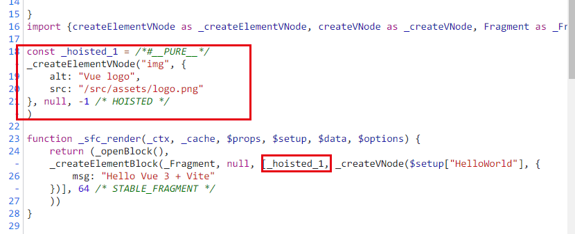
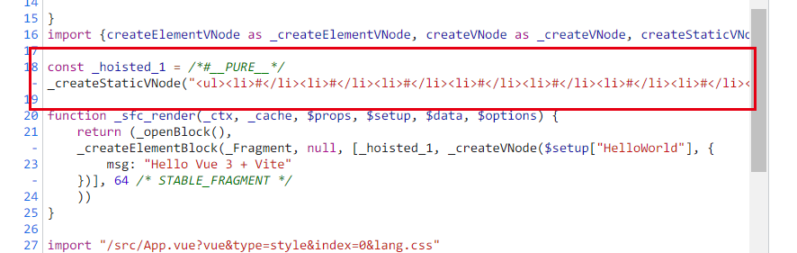

# vue3对于效率的提升

> csr渲染效率比vue2提升了1.3-2倍
> ssr渲染效率比vue2提升了2-3倍

### 静态提升

满足下面的条件节点会被提升

- 元素节点
- 没有绑定动态内容

```js
// 假设我们在vue模板里写了一个节点: <h1>hello world</h1>

// 那么通过vue2的编译, 他最终会在ender函数里调用createVNode, 如下:
render() {
 createVNode("h1", null, "hello world"); // 而且每次调用render的时候, 都会重新调用createVNode, 但其实我们会发现, 这貌似是没有必要的, 因为既然他没有绑定任何动态的属性和方法, 又不是一个组件, 那其实每次调用createVNode生成的虚拟节点也是完全一致的
}

// 所以在Vue3里, Vue团队针对这一做法进行了优化
const hoisted = createVNode("h1", null, "hello world"); // 我提前创建好虚拟节点的引用
render () {
 // 在render里知己用hoisted就可以了, 这样就减少了反复创建引用的性能损耗
}
```

比如就拿Vue3官方的例子来说

```js
// 我们知道Vue3官方的例子里会有一个img标签, 这个img标签实际上在编译中就会被创建成为静态节点
<template>
  
  <HelloWorld msg="Hello Vue 3 + Vite" />
</template>
```

官方的编译结果如下




除去静态节点, 静态属性也会被提升:

```js
<div class="user">{{ user.name }}</div>

// vue2会编译成这样
function render() {
 createVNode("div", { class: "user" }, user.name);
}

// 而vue3会这样
const hoisted = { class: "user" }
function render() {
 createVNode("div", hoisted, user.name);
}
```

### 预字符串化

当编译器遇到大量连续的静态内容, 会直接将其编译成一个普通的字符串节点, 且被预字符串化的节点不会进入虚拟dom的diff流程

```js
// 假设我们的模板里有下面这一段代码, vue3就会将其预字符串化
  <ul>
    <li>#</li>
    <li>#</li>
    <li>#</li>
    <li>#</li>
    <li>#</li>
    <li>#</li>
    <li>#</li>
    <li>#</li>
    <li>#</li>
    <li>#</li>
  </ul>
```

官方的编译结果如下:



### 缓存事件处理函数

```js
// 假设我们有这样一段代码
<button @click="count++">plus</button>

// vue2会将其编译为
render(ctx) {
 return createVNode("button", {
  onClick: function($event) {
   ctx.count ++;
  }
 })
}

// vue3会将其编译为
render(ctx, cache) {
 return createVNode("button", {
  onClick: cache[0] || (cache[0] = function($event) { ctx.count ++ } )
 })
}
```

### block tree

vue2在对比新旧树的时候, 并不知道哪些节点是静态的, 哪些是动态的, 因此只能一层一层的比较, 这样就浪费了大量的时间在比对静态节点上, 而vue3在diff的时候只要发现你是静态节点 就直接拜拜

### patch flag

vue2在对比每一个节点的时候, 并不知道这个节点的哪些信息会产生变化, 因此只能将所有的信息全部都对比一次

```js
<div class="user" data-id="1" title="user name">
    {{ user.name }}
</div>
```

在Vue3中, vue3强大的编译器会记录哪些属性是动态的, 哪些属性是静态的, 于是在diff的过程中, vue3只会比较动态的地方
